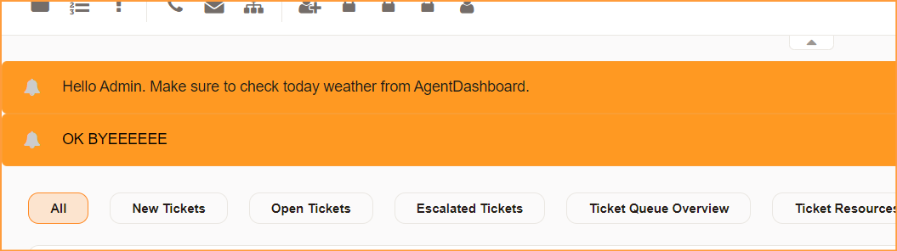

# Znuny Agent Notice

- Display simple notice in agent portal

1. Go to Admin > System Configuration > Frontend::NotifyModule###880-AgentNotice

        Action - define which screen to show the agent notice.
        Text -  text to display. Mandatory.
        URL - to display the text as URL Hyperlink. Optional.
        Group - only show the notice to specific rw group.

